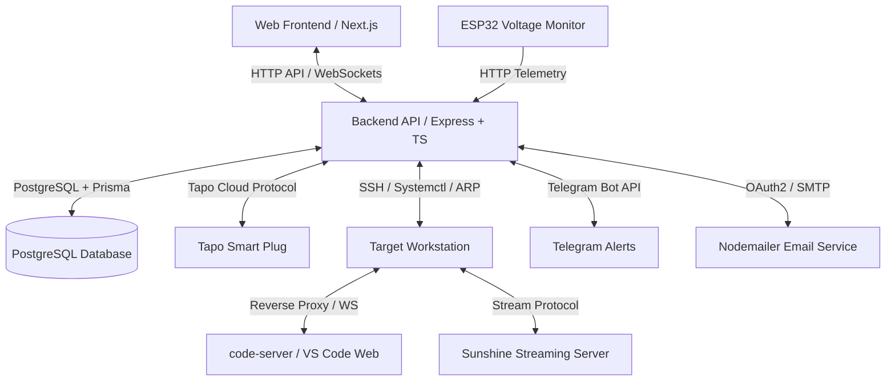

# PCtrl ⚡

> **Access, boot or shutdown your PC from anywhere.**

PCtrl is a combination of web app + hardware to remotely monitor and control my personal PC from anywhere in the world.

---

## 📐 System Architecture

PCtrl combines a Next.js web application, an Express TypeScript backend, an ESP32 voltage monitoring unit, and host SSH/Smart-Plug integrations into a single operational interface:


It is recommended to use a mesh VPN (like netbird) to access your home network.
### Subsystem Overview

* **`frontend/`**: Next.js 16 (App Router) dashboard featuring high-density telemetry, power controls, workspace session managers, user access approvals, and Sunshine streaming toggles built with Tailwind CSS v4.
* **`backend/`**: Express.js (ESM) server utilizing Prisma ORM with PostgreSQL. Manages multi-user authentication, JWT sessions, SSH host orchestration, Tapo smart plug integration, dynamic `code-server` reverse proxying with WebSocket support, Telegram alert dispatching, and ESP32 telemetry parsing.
* **`esp32/pctrl-voltage-monitor/`**: PlatformIO C++ firmware targeting ESP32 microcontrollers. Monitors grid voltage levels and emits state updates (`NORMAL`, `BROWNOUT`, `POWERCUT`) to the backend.

---

## ✨ Key Features

### 🔌 Hardware & Power Management
* **Smart Plug Power Control**: Direct integration with TP-Link Tapo Smart Plugs for hard toggles, reboot cycles, and power state verification.
* **Graceful SSH Shutdown & WOL Boot**: Safe machine shutdown execution via SSH (`systemctl poweroff` / `loginctl`) with smart power cut interlocking to prevent filesystem corruption.
* **Network Host Discovery**: Polling via ARP scan (`arpscan`, `@network-utils/arp-lookup`) and SSH reachability checks.
* **Grid Voltage Telemetry**: ESP32 telemetry ingestion to detect grid power degradation, brownouts, and unexpected mains outages.

### 💻 Remote Workspaces & Services
* **Dynamic Code-Server Isolation**: Launch and manage isolated `code-server` (VS Code in browser) instances per user session with random auto-generated passwords and dedicated port allocation.
* **Authenticated WebSocket Reverse Proxy**: Zero-leak HTTP/WS proxy routing user traffic directly to their allocated `code-server` instance using cookie JWT auth verification.
* **Sunshine Game & Remote Desktop Streaming**: Remote process management and device pairing control for the Sunshine streaming server on Wayland/X11 hosts.

### 🔐 Access Governance & Notifications
* **Role-Based Access Control (RBAC)**: Supports `ROOT`, `ADMIN`, and `USER` roles with account state enforcement (`PENDING`, `GRANTED`, `SUSPENDED`, `REJECTED`).
* **Telegram Bot Notifications**: Real-time alerts sent to Telegram chat for power cut events, forced shutdowns, brownouts, and system recovery.
* **Email Password Reset**: Secure OAuth2/SMTP-powered password reset workflow.

---

## 🎨 Design System: "The Calibrated Power Instrument"

PCtrl follows a strict dark industrial aesthetic defined in `DESIGN.md`:

* **Canvas**: Graphite `#0b0e11` background with subtle tonal depth.
* **Signal Green (`#54d88b`)**: Hardware operational state & successful command execution.
* **Electric Cyan (`#5dcff5`)**: Primary navigation, active focus, and interactive state.
* **Caution Amber (`#f7bc4d`)**: Degraded conditions or brownout telemetry.
* **Danger Red (`#f26d70`)**: Destructive actions (plug hard cuts, forced shutdowns).

---

## 📁 Repository Structure

```text
PCtrl/
├── backend/                    # Node.js + Express + Prisma API
│   ├── prisma/                 # PostgreSQL schema definitions & migrations
│   ├── src/
│   │   ├── controllers/        # API logic (auth, pc, sessions, sunshine, esp32)
│   │   ├── lib/                # SSH, Tapo, JWT, Telegram, Proxy utilities
│   │   ├── middlewares/        # Auth & access verification
│   │   └── routes/             # Express endpoint router definitions
│   └── scripts/                # System helper utilities
├── frontend/                   # Next.js 16 Web Dashboard
│   ├── src/
│   │   ├── app/                # App router pages (dashboard, admin, sunshine, auth)
│   │   ├── components/         # UI elements (power cards, telemetry, session views)
│   │   └── lib/                # Frontend API client & utils
│   └── public/                 # Static assets
├── esp32/                      # ESP32 Voltage Monitor Firmware
│   └── pctrl-voltage-monitor/  # PlatformIO C++ project for ESP32-C6 / ESP32
├── DESIGN.md                   # UI/UX Design System Specification
├── .env_sample                 # Sample .env file
└── package.json                # Workspace root package declaration
```

---

## 🛠️ Prerequisites

### Host Environment Requirements
* **Operating System**: Linux (Debian/Ubuntu/Fedora) for host orchestration script support.
* **System Utilities**: `net-tools` (for `tapoo`/network operations) and `arp-scan` (`sudo apt install net-tools arp-scan`).
* **Node.js**: v20.x or higher.
* **Database**: PostgreSQL server.
* **Workstation Software** (Target PC):
  * `code-server` binary installed and accessible to target user.
  * `sunshine` streaming server installed.
  * Wayland / X11 session configured with accessible socket paths.
  * If utilizing a saperate user for ssh, ensure the user has passwordless sudo privileges for systemctl poweroff and loginctl commands.

---

## ⚙️ Environment Configuration

Create a `.env` file inside `backend/` based on the configuration options in `.env_sample`

Configure `frontend/.env.local` if custom backend URL is required:
```env
NEXT_PUBLIC_BACKEND_URL=http://localhost:4000
```

---

## 🚀 Getting Started

### 1. Database Setup
```bash
cd backend
npm install
npx prisma db push
```

### 2. Start the Backend Server
```bash
cd backend
npm run dev
```
*The backend API server will run on `http://localhost:4000`.*

### 3. Start the Frontend Application
```bash
cd frontend
npm install
npm run dev
```
*Open [http://localhost:3000](http://localhost:3000) in your browser.*

### 4. Build ESP32 Firmware (Optional)
Using [PlatformIO CLI](https://platformio.org/):
```bash
cd esp32/pctrl-voltage-monitor
pio run -t upload
```

---
